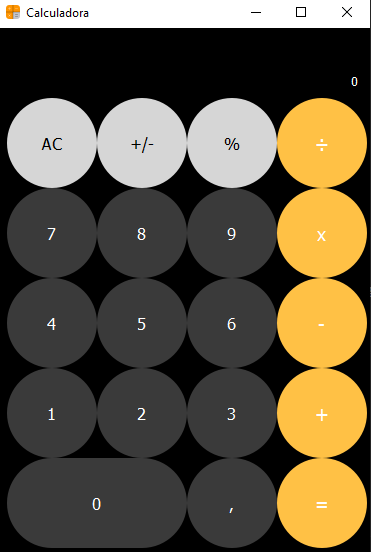

# Calculadora iPhone.py 

<div align="center"> </div>



> Projeto desenvolvido durante o período do curso em Técnico em Desenvolvimento de Sistemas 

## 💻 Pré-requisitos

Antes de começar, verifique se você atendeu aos seguintes requisitos:

- Você instalou a versão mais recente de `Python 3.12`
- Você tem uma máquina `Windows/Linux`.
- Configurado o Ambiente Virtual:
- ` Python -m venv env`
- Você tem instalado as seguintes dependências
- `PyQt5`.
- `Auto-py-to-exe`.

### Ajustes e melhorias

O projeto ainda está em desenvolvimento e as próximas atualizações serão voltadas nas seguintes tarefas:

- [x] Interface Gráfica
- [x] Layout
- [ ] Ajustar tamanho da fonte do display
- [ ] Implementar notação científica
- [ ] Pré-definir o tamanho fixo da interface


## 🚀 Instalando Calculadora iPhone

Para instalar a Calculadora iPhone, siga estas etapas:

Windows:

```
python -m venv env
env\Scripts\Activate.ps1
python -m pip install auto-py-to-exe
```

## ☕ Usando Calculadora iPhone

Para usar Calculadora iPhone, siga estas etapas:

```
python main.py
```

## 📫 Contribuindo para Calculadora iPhone

Para contribuir com Calculadora iPhone, siga estas etapas:

1. Bifurque este repositório.
2. Crie um branch: `git checkout -b Calculadora-iPhone`.
3. Faça suas alterações e confirme-as: `git commit -m '<mensagem_commit>'`
4. Envie para o branch original: `git push origin <nome_do_projeto> / <local>`
5. Crie a solicitação de pull.

Como alternativa, consulte a documentação do GitHub em [como criar uma solicitação pull](https://help.github.com/en/github/collaborating-with-issues-and-pull-requests/creating-a-pull-request).

## 🤝 Colaboradores

Agradecemos às seguintes pessoas que contribuíram para este projeto:

<table>
  <tr>
    <td align="center">
      <a href="#" title="Bruno Rodrigues">
        <br>
        <sub>
          <b>Bruno Rodrigues Silva</b>
        </sub>
      </a>
    </td>
  </tr>
</table>
